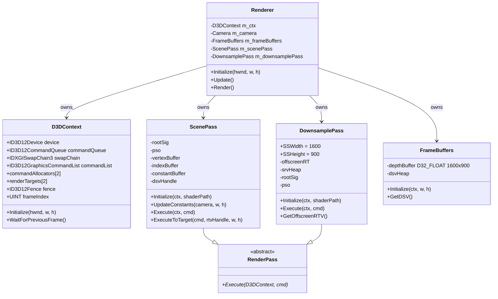
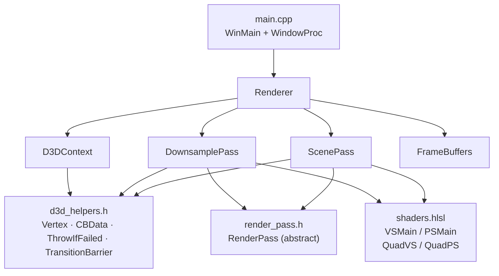
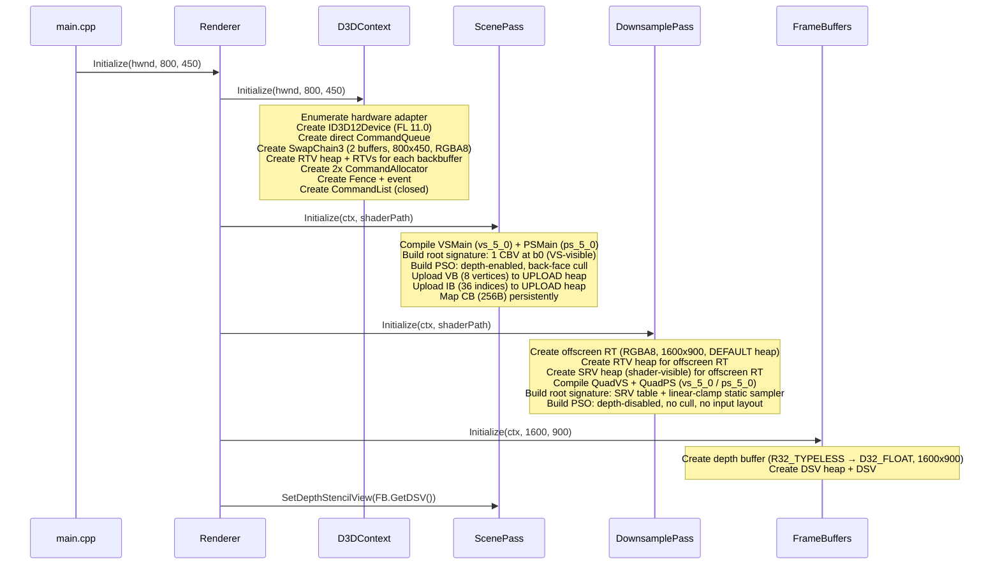
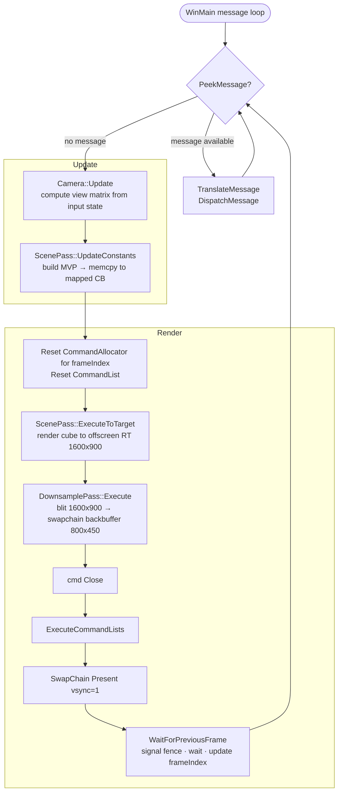
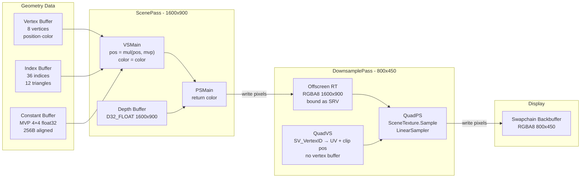
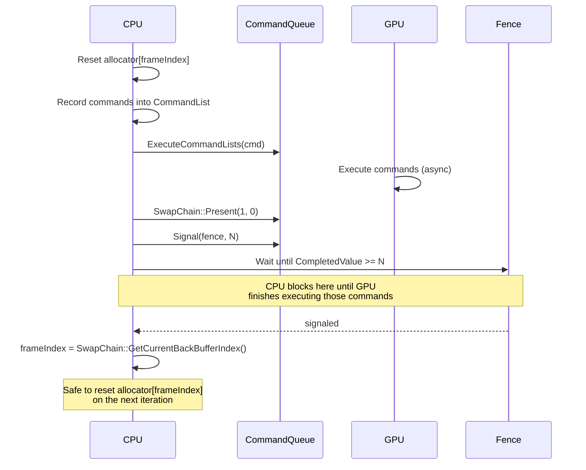
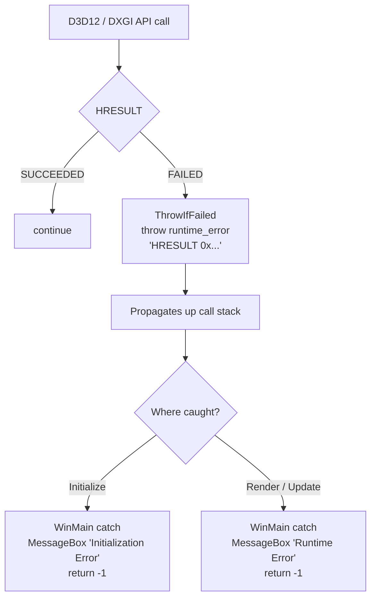

# DirectX 12 SSAA Renderer — Architecture Reference

## Overview

A Windows DirectX 12 renderer that draws a colored cube at **2× supersampled resolution** (1600×900) and downsamples to an **800×450 display backbuffer** via a fullscreen blit, producing anti-aliased output without MSAA.

---

## Project Structure

```
src/
  main.cpp               — WinMain + WindowProc; no D3D12 logic
  renderer.h/.cpp        — Central orchestrator; owns all subsystems
  d3d_context.h/.cpp     — Raw D3D12 device, queue, swapchain, fence
  d3d_helpers.h          — ThrowIfFailed, Vertex, ConstantBufferData, TransitionBarrier
  frame_buffers.h/.cpp   — Shared depth buffer for scene rendering
  camera.h/.cpp          — First-person WASD camera
  shaders.hlsl           — All shaders: scene (VSMain/PSMain) + downsample (QuadVS/QuadPS)
  passes/
    render_pass.h        — Pure virtual base: Execute(D3DContext&, cmd*)
    scene_pass.h/.cpp    — Cube: root signature, PSO, VB/IB/CB
    downsample_pass.h/.cpp — Offscreen RT (1600x900) + fullscreen blit to swapchain
```

---

## Component Architecture

### Class Diagram



### Module Dependency Graph



---

## Initialization



---

## Per-Frame Render Loop



---

## SSAA Rendering Pipeline

The scene is rendered at **2× linear resolution** (1600×900 = 4× the pixel count of 800×450), then linearly downsampled. This is 2× SSAA — each display pixel averages a 2×2 block of rendered samples.



### Fullscreen Triangle Trick

`QuadVS` generates clip-space positions and UVs purely from `SV_VertexID` — no vertex buffer is needed:

| VertexID | UV | Clip position |
|---|---|---|
| 0 | (0, 0) | (-1, -1) |
| 1 | (0, 2) | (-1,  3) |
| 2 | (2, 0) | ( 3, -1) |

The triangle over-covers the screen; the rasterizer clips it to the viewport automatically.

---

## Resource State Transitions

D3D12 requires explicit barriers before changing how a resource is used. The diagram below shows every barrier issued in a typical frame.

```mermaid
sequenceDiagram
    participant OFF as Offscreen RT
    participant SC as Swapchain Backbuffer
    participant CMD as Command List

    Note over OFF: initial state: RENDER_TARGET
    Note over SC: initial state: PRESENT

    rect rgb(220,235,255)
        Note over CMD: ScenePass::ExecuteToTarget
        CMD->>OFF: draw 36 indices (cube) → write depth + color
    end

    rect rgb(255,240,220)
        Note over CMD: DownsamplePass::Execute — barrier batch 1
        CMD->>OFF: Barrier RENDER_TARGET → PIXEL_SHADER_RESOURCE
        CMD->>SC: Barrier PRESENT → RENDER_TARGET
    end

    rect rgb(220,255,230)
        Note over CMD: DownsamplePass::Execute — draw
        CMD->>SC: DrawInstanced(3) — fullscreen blit sampling OFF
    end

    rect rgb(255,240,220)
        Note over CMD: DownsamplePass::Execute — barrier batch 2
        CMD->>SC: Barrier RENDER_TARGET → PRESENT
        CMD->>OFF: Barrier PIXEL_SHADER_RESOURCE → RENDER_TARGET
    end

    Note over SC: SwapChain::Present()
    Note over OFF: ready for next frame
```

---

## Shaders

All shaders are in a single `shaders.hlsl` file and compiled at runtime via `D3DCompileFromFile`.

### Scene Shaders — `VSMain` / `PSMain`

Used by **ScenePass**. Renders the cube with per-vertex color and depth.

```mermaid
flowchart LR
    IA["Input Assembler\nPOSITION float3\nCOLOR    float4"]
    CB2["cbuffer b0\nmatrix mvp"]
    VS2["VSMain\nout.pos = mul&#40;pos4, mvp&#41;\nout.color = color"]
    PS2["PSMain\nreturn input.color"]
    OUT["Render Target\nRGBA8 pixel\n+ depth write"]

    IA --> VS2
    CB2 --> VS2
    VS2 --> PS2
    PS2 --> OUT
```



### Downsample Shaders — `QuadVS` / `QuadPS`

Used by **DownsamplePass**. Blits the offscreen RT to the swapchain with bilinear filtering.

```mermaid
flowchart LR
    VID["SV_VertexID\n0 · 1 · 2"]
    QVS2["QuadVS\nderive UV from vertex ID\ncompute clip-space pos"]
    TEX["SceneTexture t0\noffscreen RT 1600x900"]
    SAM["LinearSampler s0\nbilinear + clamp"]
    QPS2["QuadPS\nSceneTexture.Sample&#40;sampler, uv&#41;"]
    OUT2["Swapchain RT\nRGBA8 pixel 800x450"]

    VID --> QVS2
    QVS2 --> QPS2
    TEX --> QPS2
    SAM --> QPS2
    QPS2 --> OUT2
```



---

## Double Buffering and CPU/GPU Synchronization

`FrameCount = 2`: two swapchain backbuffers and two command allocators. The CPU must not reset an allocator whose commands the GPU is still executing.



---

## Pipeline State Objects

| | ScenePass | DownsamplePass |
|---|---|---|
| Vertex shader | `VSMain` | `QuadVS` |
| Pixel shader | `PSMain` | `QuadPS` |
| Input layout | `POSITION` + `COLOR` | none (vertex-ID only) |
| Depth test | Enabled (`LESS`) | Disabled |
| Depth write | Enabled | Disabled |
| Cull mode | Back-face | None |
| Blend | Disabled | Disabled |
| Render target format | `RGBA8_UNORM` | `RGBA8_UNORM` |
| Render target size | 1600 × 900 | 800 × 450 |

---

## Error Handling

All D3D12 API calls go through `ThrowIfFailed`. Any `HRESULT` failure throws `std::runtime_error`, which propagates to `WinMain` and surfaces as a `MessageBox`.


